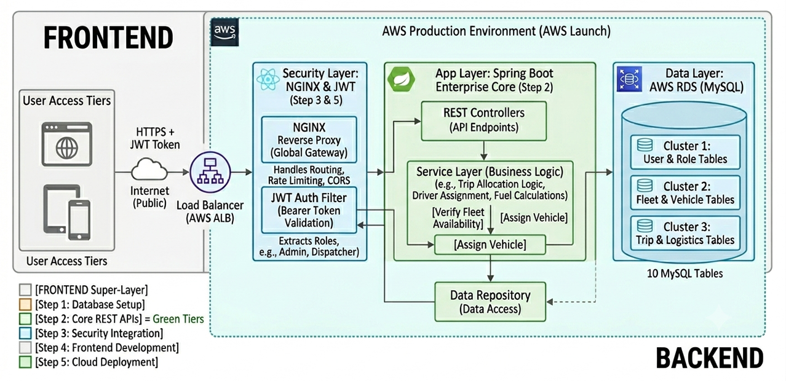

# 🚚 Logistics & Fleet Management System

An enterprise-grade, full-stack logistics and fleet management platform engineered for real-time trip allocation, fuel tracking, vehicle maintenance scheduling, and secure role-based operational control (RBAC).

Built with a robust **Spring Boot** backend, **React** frontend, and **MySQL** database, features automated vehicle dispatching and audit logging, and is fully automated via a **GitHub Actions CI/CD pipeline** deployed on **AWS EC2** behind an **NGINX Reverse Proxy**.

---

## 🏗️ System Architecture & Workflow



The platform follows a layered production architecture designed for high availability, security, and scalable deployment on **AWS Cloud Environment**.

```text
+-------------------------------------------------------------------------------+
|                                FRONTEND TIER                                  |
|   +-----------------------------------------------------------------------+   |
|   |                  User Access Tiers (Web / Mobile)                     |   |
|   |                      (React.js + Vite Engine)                          |   |
|   +-----------------------------------------------------------------------+   |
+-----------------------------------++------------------------------------------+
                                    || HTTPS + Bearer JWT Tokens
                                     v
+-------------------------------------------------------------------------------+
|                        AWS PRODUCTION CLOUD ENVIRONMENT                       |
|                                                                               |
|  +-------------------------------------------------------------------------+  |
|  |                       Load Balancer (AWS ALB / Cloud)                   |  |
|  +------------------------------------++-----------------------------------+  |
|                                       ||                                      |
|  +------------------------------------v----------------------------------+  |
|  | Security Layer: NGINX Reverse Proxy & Static Web Host (/var/www/html)   |  |
|  +------------------------------------++-----------------------------------+  |
|                                       || Verified API Requests (/api/*)       |
|  +------------------------------------v----------------------------------+  |
|  | App Layer: Spring Boot Enterprise Core (Port 8080 - systemd Service)    |  |
|  |   * REST Controllers (API Gateway & Web Security Filters)               |  |
|  |   * Service Layer (Trip Allocation Logic, Fuel & Maintenance Engine)    |  |
|  |   * Data Repositories (Spring Data JPA / Hibernate ORM)                 |  |
|  +------------------------------------++-----------------------------------+  |
|                                       || Secure DB Connections (Port 3306)    |
|  +------------------------------------v----------------------------------+  |
|  | Data Layer: AWS RDS (MySQL - 10 Relational Tables)                      |  |
|  |   * Cluster 1: User, Authentication & IAM Role Tables                   |  |
|  |   * Cluster 2: Fleet, Driver & Vehicle Management Tables                |  |
|  |   * Cluster 3: Trip Manifests, Fuel Logs & Logistics Tables             |  |
|  +-------------------------------------------------------------------------+  |
+-------------------------------------------------------------------------------+
```
---

## ✨ Features & Capabilities

### 🔐 Multi-Role Access Control (RBAC)
* **ADMIN:** Complete system oversight, Identity & Access Management (IAM), user role promotions, fleet asset configurations, and global system audit logs.
* **EMPLOYEE / DISPATCHER:** Logistics Operations Hub, shipment booking, vehicle allocation, driver assignment, and real-time trip manifest dispatching.
* **DRIVER:** Personal trips dashboard, vehicle onboarding status, route updates, and availability toggles.
* **CUSTOMER / USER:** Shipment booking requests and live cargo tracking.

### 🚚 Fleet & Vehicle Lifecycle Management
* **Asset Onboarding:** Register vehicles with details including registration number, capacity payload, fuel type, and operational status.
* **Maintenance Scheduling:** Preventive maintenance tracking, automated service alerts, and repair history logs to minimize vehicle downtime.
* **Driver Assignment:** Dynamic allocation of drivers based on current availability, route licensing, and vehicle compatibility.

### 📍 Trip Manifest & Logistics Operations
* **Automated Dispatch Engine:** Real-time trip generation linking drivers, vehicles, routes, and cargo payloads seamlessly.
* **Fuel Tracking & Optimization:** Log fuel consumption per trip, calculate efficiency metrics, and track operating expenses.
* **Status Tracking:** End-to-end trip lifecycle tracking (`PENDING` ➔ `DISPATCHED` ➔ `IN_TRANSIT` ➔ `DELIVERED` / `CANCELLED`).

### 📊 Analytics & Audit Logging
* **System Audit Logs:** maintenance logs, fuel logs and shipment tracking logs tracking sensitive user actions, role modifications, and system configuration updates for accountability.
* **Operational Dashboard:** Visual breakdown of active fleet availability, pending shipments, and completed deliveries.

### 🛡️ Security & Enterprise Integration
* **JWT Authentication:** Stateless, token-based authentication using JSON Web Tokens (JWT) with secure Bearer header authorization.
* **Spring Security Authorization:** Fine-grained endpoint protection restricting REST API routes based on specific user roles.
* **CORS & Reverse Proxy Guard:** Configured NGINX proxies with custom headers to prevent unauthorized cross-origin requests.

### 🚛 Core Modules
* **Logistics Operations Hub:** End-to-end management of active dispatches, maintenance auto-triggers, fuel calculation metrics, and trip lifecycle states.
* **Vehicle & Driver Management:** Driver-to-vehicle mapping, status monitoring (Available, In-Transit, Maintenance), and asset health logs.
* **Audit & Compliance:** Detailed activity logging across all nodes for security and system parameters tracking.

---

## 🛠️ Tech Stack & Tools

| Layer | Technologies & Tools |
| :--- | :--- |
| **Frontend** | React.js, Vite, Tailwind CSS, Lucide Icons, Axios |
| **Backend** | Java 17+, Spring Boot, Spring Security (JWT), Spring Data JPA, Hibernate |
| **Database** | MySQL 8.0 (13 Relational Tables) |
| **Web Server & Reverse Proxy** | NGINX, Systemd Services, Linux Security (chmod/chown) |
| **DevOps & Cloud Deployment** | AWS EC2 (Ubuntu), GitHub Actions (Self-Hosted Runner), CI/CD |
| **Build Tools & Utilities** | Maven (`pom.xml`), Git, Node.js (v20), MobaXterm, Postman |

---
## 📂 Project Structure

```text
Logistics-And-Fleet-management/
├── .github/
│   └── workflows/              # GitHub Actions CI/CD deployment pipelines
├── Backend/                    # Spring Boot Enterprise Application
│   ├── src/
│   │   └── main/
│   │       └── java/
│   │           └── com/
│   │               └── example/
│   │                   └── Logistics/
│   │                       ├── controller/      # REST API Controllers & Endpoints
│   │                       ├── exception/       # Global Exception Handlers
│   │                       ├── model/           # JPA Entities & Data Models
│   │                       ├── repository/      # Spring Data JPA Interfaces
│   │                       ├── security/        # Spring Security & JWT Configuration
│   │                       ├── service/         # Business Logic Layer
│   │                       └── LogisticsApplication.java
│   ├── .mvn/                   # Maven Wrapper configurations
│   ├── pom.xml                 # Maven Dependencies & Build Configuration
│   └── mvnw                    # Executable Maven Wrapper
├── frontend/                   # React.js SPA (Vite / Dashboard)
│   ├── src/
│   │   ├── components/         # Reusable UI Components
│   │   ├── pages/              # Route Pages (Dashboard, Fleet, Trips, etc.)
│   │   └── services/           # Axios API Client & Authentication Services
│   ├── package.json            # Node.js Dependencies & Scripts
│   └── vite.config.js          # Build & Dev Server Configs
├── logistics_db.sql            # Database Schema & Initial Seed Data
├── logistics_ERD.mwb           # MySQL Workbench Data Model File
├── projectplan.PNG             # Architecture & Planning Diagram
└── README.md                   # Project Documentation

```
## 🚀 Getting Started

### 📋 Prerequisites

Before you begin, ensure you have the following installed on your local machine:

* **Java Development Kit (JDK):** Version 17 or higher
* **Node.js & npm:** Node.js v18+ (v20 recommended) and npm
* **Database:** MySQL Server v8.0+
* **Build Tool:** Maven 3.8+ (or use the included `./mvnw` wrapper)

---

## 💾 1. Database Setup

1. Open your preferred MySQL client (e.g., **MySQL Workbench** or Terminal).
2. Create the primary database instance:
   ```sql
   CREATE DATABASE logistics_db;

## ⚙️ 2. Backend Setup (Spring Boot)

1.Navigate to the backend root directory:

```bash
cd Backend
```
2. Configure your database connection credentials in src/main/resources/application.properties:

```bash
# Database Connection Settings
spring.datasource.url=jdbc:mysql://localhost:3306/logistics_db?useSSL=false&serverTimezone=UTC
spring.datasource.username=YOUR_MYSQL_USERNAME
spring.datasource.password=YOUR_MYSQL_PASSWORD

# JPA / Hibernate Configs
spring.jpa.hibernate.ddl-auto=update
spring.jpa.show-sql=true
```
3. Build and launch the Spring Boot application:

```bash
./mvnw spring-boot:run
```
The backend REST API service will start on http://localhost:8080.

## 💻3. Frontend Setup (React)

1. Navigate to the frontend directory:

```bash
cd ../frontend
```
2. Install all required Node.js dependencies

```bash
npm install
```
3. Launch the local development server:

```bash
npm run dev
```
The frontend application will be accessible at http://localhost:5173 (or port specified by Vite).

## ☁️ 4. Production Deployment on AWS EC2 (Ubuntu)

This section details the step-by-step production setup on an **AWS EC2 Ubuntu Instance** using **Spring Boot as a systemd background service**, **React production build**, and **NGINX as a Reverse Proxy & Static File Host**.

---

### 🌐 Step 4.1: Server Update, Package Installation & Code Cloning
Update the local package repositories, install required dependencies, and clone the project repository:

```bash
# Update Ubuntu package indexes
sudo apt update && sudo apt upgrade -y

# Install OpenJDK 17, NGINX, Git, and essential utilities
sudo apt install -y openjdk-17-jdk nginx git curl

# Add NodeSource Node.js v20 repository and install Node.js & npm
curl -fsSL https://deb.nodesource.com/setup_20.x | sudo -E bash -
sudo apt install -y nodejs

# Verify all installed tools and system service versions
java -version
node -v
npm -v
git --version
nginx -v

# Clone the application repository to the server home directory
git clone https://github.com/alizamemon/Logistics-And-Fleet-management.git

# Verify NGINX is installed and actively running
sudo systemctl status nginx
```
### ⚙️ Step 4.2: Backend Deployment (logistics.service)

1. Build Executable JAR File:
Navigate to the backend directory and compile the production build:
```bash
cd /path/to/Logistics-And-Fleet-management/Backend
./mvnw clean package
```
2. Setup Permanent Application Directory:
Move the built JAR artifact to a secure system directory:
```bash
sudo mkdir -p /var/www/logistics
sudo cp target/Logistics-0.0.1-SNAPSHOT.jar /var/www/logistics/logistics.jar
```
3. Create Systemd Background Service:
Create a new service configuration file named logistics.service:
```bash
sudo nano /etc/systemd/system/logistics.service  
```
4. Paste the following Systemd Configuration:
```bash
[Unit]
Description=Logistics Spring Boot Backend Service
After=network.target

[Service]
User=ubuntu
EnvironmentFile=/etc/logistics.env
WorkingDirectory=/home/ubuntu/Logistics-And-Fleet-management/Backend
ExecStart=/usr/bin/java -jar /home/ubuntu/Logistics-And-Fleet-management/Backend/target/Logistics-0.0.1-SNAPSHOT.jar
SuccessExitStatus=143
Restart=always
RestartSec=10

[Install]
WantedBy=multi-user.target
```
5. Register, Enable, and Start the Service:
```bash
# Reload systemd manager to detect the new logistics service
sudo systemctl daemon-reload

# Enable logistics service to automatically run on server reboots
sudo systemctl enable logistics

# Start the logistics backend service
sudo systemctl start logistics

# Verify the active status of the service (Running on Port 8080)
sudo systemctl status logistics
```
### 💻 Step 4.3: Frontend Deployment (React Asset Hosting)

1. Build Production Assets:
Navigate to the frontend directory and generate optimized production static files:
```bash
cd /path/to/Logistics-And-Fleet-management/frontend
npm install
npm run build
```

2.Deploy Build Assets to Web Directory:
Copy the generated dist folder contents into NGINX's root directory and fix ownership permissions:
```bash
# Copy static HTML, CSS, JS build files
sudo cp -r dist/* /var/www/html/

# Set Read & Execute permissions for web visitors
sudo chmod -R 755 /var/www/html

# Transfer ownership to NGINX process user (www-data)
sudo chown -R www-data:www-data /var/www/html
```

### 🛡️ Step 4.4: NGINX Reverse Proxy Configuration

1. Edit Default Server Block File:
```bash
sudo nano /etc/nginx/sites-available/default
```
2. Paste the Full NGINX Configuration:
```bash
server {
    listen 80;
    server_name _;

    root /var/www/html;
    index index.html index.htm;

    location / {
        try_files $uri $uri/ /index.html;
    }

    location /frontend {
        try_files /index.html =404;
    }

    location /api/ {
        proxy_pass http://localhost:8080;
        proxy_set_header Host $host;
        proxy_set_header X-Real-IP $remote_addr;
        proxy_set_header X-Forwarded-For $proxy_add_x_forwarded_for;
        proxy_set_header X-Forwarded-Proto $scheme;
    }

    location /actuator/ {
        proxy_pass http://localhost:8080;
        proxy_set_header Host $host;
        proxy_set_header X-Real-IP $remote_addr;
        proxy_set_header X-Forwarded-For $proxy_add_x_forwarded_for;
        proxy_set_header X-Forwarded-Proto $scheme;
    }
}
```
3. Test and Reload NGINX Web Server:
```bash
# Test NGINX configuration syntax for any mistakes
sudo nginx -t

# Reload NGINX without downtime to apply changes
sudo systemctl reload nginx
```
### 🔍 Step 4.5: Service Verification & Diagnostic Commands

Useful commands to inspect running services, view real-time logs, and monitor server resource usage:
```bash
# View real-time output logs for the Spring Boot application
sudo journalctl -u logistics -f --output=cat

# Inspect active running systemd services
systemctl list-units --type=service --state=running

# Monitor live CPU and RAM consumption on the server
top
```
---

## 🔗 Live Access

🌐 **Public IP:** [http://98.81.233.145/](http://98.81.233.145/)
